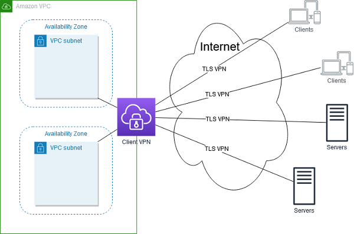

# AWS Client VPN
AWS Client VPN is a managed client-based VPN service that enables you to securely access your AWS resources or your on-premises network. With AWS Client VPN, you configure an endpoint to which your users can connect to establish a secure TLS VPN session. This enables clients to access resources in AWS or on-premises from any location using an OpenVPN-based VPN client

## Features of Client VPN
- Secure connections 
- Managed service
- High availability and elasticity 
- Authentication 
- Granular control
- Ease of use
- Manageability
- Deep integration

## Components of Client VPN

The following are the key concepts for Client VPN:

### Client VPN endpoint

The Client VPN endpoint is the resource that you create and configure to enable and manage client VPN sessions. It is the resource where all client VPN sessions are terminated.

### Target network

A target network is the network that you associate with a Client VPN endpoint. A subnet from a VPC is a target network. Associating a subnet with a Client VPN endpoint enables you to establish VPN sessions. You can associate multiple subnets with a Client VPN endpoint for high availability. All subnets must be from the same VPC. Each subnet must belong to a different Availability Zone.

### Route

Each Client VPN endpoint has a route table that describes the available destination network routes. Each route in the route table specifies the path for traffic to specific resources or networks.

### Authorization rules

An authorization rule restricts the users who can access a network. For a specified network, you configure the Active Directory or identity provider (IdP) group that is allowed access. Only users belonging to this group can access the specified network. By default, there are no authorization rules and you must configure authorization rules to enable users to access resources and networks.

### Client

The end user connecting to the Client VPN endpoint to establish a VPN session. End users need to download an OpenVPN client and use the Client VPN configuration file that you created to establish a VPN session.

### Client CIDR range

An IP address range from which to assign client IP addresses. Each connection to the Client VPN endpoint is assigned a unique IP address from the client CIDR range. You choose the client CIDR range, for example, 10.2.0.0/16.

### Client VPN ports

AWS Client VPN supports ports 443 and 1194 for both TCP and UDP. The default is port 443.

### Client VPN network interfaces

When you associate a subnet with your Client VPN endpoint, we create Client VPN network interfaces in that subnet. Traffic that's sent to the VPC from the Client VPN endpoint is sent through a Client VPN network interface. Source network address translation (SNAT) is then applied, where the source IP address from the client CIDR range is translated to the Client VPN network interface IP address.

### Connection logging

You can enable connection logging for your Client VPN endpoint to log connection events. You can use this information to run forensics, analyze how your Client VPN endpoint is being used, or debug connection issues.

### Self-service portal

You can enable a self-service portal for your Client VPN endpoint. Clients can log into the web-based portal using their credentials and download the latest version of the Client VPN endpoint configuration file, or the latest version of the AWS provided client.

### Limitations and rules of Client VPN

- The subnets associated with a Client VPN endpoint must be in the same VPC.

- You cannot associate multiple subnets from the same Availability Zone with a Client VPN endpoint.

- A Client VPN endpoint does not support subnet associations in a dedicated tenancy VPC.

- Client VPN supports IPv4 traffic only.
