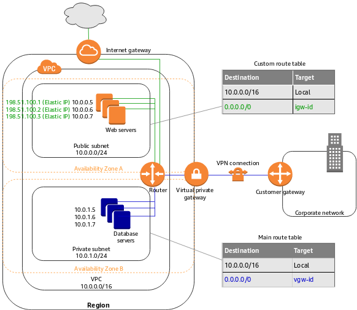

# AWS Route Table
A route table contains a set of rules, called routes, that are used to determine where network traffic from your subnet or gateway is directed. 

## Route table concepts

The following are the key concepts for route tables.

### Main route table
The route table that automatically comes with your VPC. It controls the routing for all subnets that are not explicitly associated with any other route table.

### Custom route table 
A route table that you create for your VPC.

### Edge association
A route table that you use to route inbound VPC traffic to an appliance. You associate a route table with the internet gateway or virtual private gateway, and specify the network interface of your appliance as the target for VPC traffic.

### Route table association 
The association between a route table and a subnet, internet gateway, or virtual private gateway.

### Subnet route table 
A route table that's associated with a subnet.

### Gateway route table 
A route table that's associated with an internet gateway or virtual private gateway.

### Local gateway route table 
A route table that's associated with an Outposts local gateway. For information about local gateways, see Local Gateways in the AWS Outposts User Guide.

### Destination 
The range of IP addresses where you want traffic to go (destination CIDR). For example, an external corporate network with a 172.16.0.0/12 CIDR.

### Propagation 
Route propagation allows a virtual private gateway to automatically propagate routes to the route tables. This means that you don't need to manually enter VPN routes to your route tables. 
> For more information about VPN routing options, see Site-to-Site VPN routing options in the Site-to-Site VPN User Guide.

### Target 
The gateway, network interface, or connection through which to send the destination traffic; for example, an internet gateway.

### Local route
A default route for communication within the VPC.

