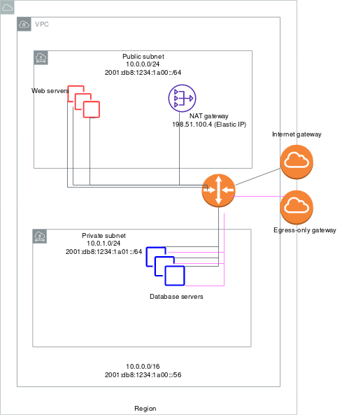

# AWS-VPC
Amazon Virtual Private Cloud (Amazon VPC) enables you to launch AWS resources into a virtual network that you've defined. This virtual network closely resembles a traditional network that you'd operate in your own data center, with the benefits of using the scalable infrastructure of AWS. 

## Amazon VPC concepts

The following are the key concepts for VPCs:

### Virtual private cloud (VPC)
A virtual network dedicated to your AWS account.

### Subnet
A range of IP addresses in your VPC.

### Route table
A set of rules, called routes, that are used to determine where network traffic is directed.

### Internet gateway
A gateway that you attach to your VPC to enable communication between resources in your VPC and the internet.

### VPC endpoint
Enables you to privately connect your VPC to supported AWS services and VPC endpoint services powered by PrivateLink without requiring an internet gateway, NAT device, VPN connection, or AWS Direct Connect connection. Instances in your VPC do not require public IP addresses to communicate with resources in the service. Traffic between your VPC and the other service does not leave the Amazon network. For more information, see AWS PrivateLink and VPC endpoints.

### CIDR block 
Classless Inter-Domain Routing. An internet protocol address allocation and route aggregation methodology

> CIDR: classless inter-domain routing
