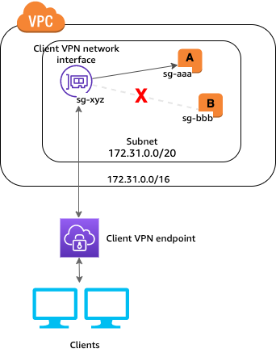

# Authentication
It ensure that wether the client is allow to establish a vpn-session or not.

## Types of authentication Sytem that we have is:
- Certificate based
- AD Authentication
- Single-sign-on : SAML

For more details you can refer the <a href="https://docs.aws.amazon.com/vpn/latest/clientvpn-admin/client-authentication.html">Link</a>

# Authorization
Client VPN supports two types of authorization: security groups and network-based authorization.

## Security Group
You can enable Client VPN users to access your applications in a VPC by adding a rule to your applications' security groups to allow traffic from the security group that was applied to the association. 

## Network-based authorization

Network-based authorization is implemented using authorization rules. For each network that you want to enable access, you must configure authorization rules that limit the users who have access. For a specified network, you configure the Active Directory group or the SAML-based IdP group that is allowed access. Only users who belong to the specified group can access the specified network. If you are not using Active Directory or SAML-based federated authentication, or you want to open access to all users, you can specify a rule that grants access to all clients.