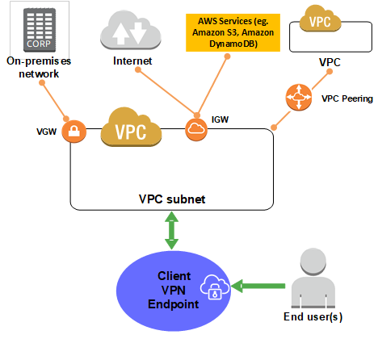

# How AWS Client VPN works

If we are talking about the working mechanism of aws client vpn, so there are two types of user that interact with the Client VPN endpoint: 
- administrators 
- clients

## Administrators
Administrator is responsible for setting up and configuring the service. 

- creating the Client VPN endpoint
- associating the target network
- configuring the authorization rules
- setting up additional routes

> After the Client VPN endpoint is set up and configured, the administrator downloads the Client VPN endpoint configuration file and distributes it to the clients who need access. 

## Client
The client is the end user. This is the person who connects to the Client VPN endpoint to establish a VPN session.