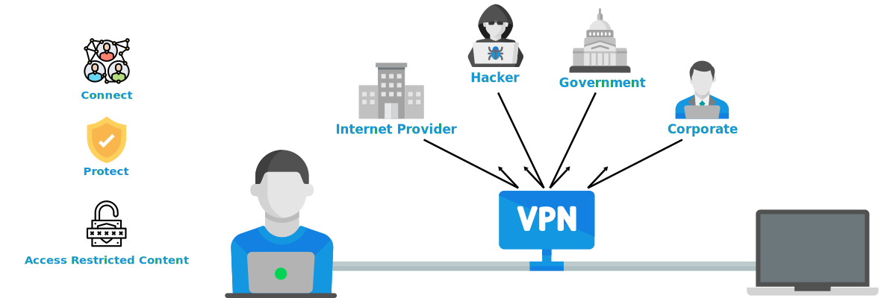

# Improving the current architecture using client vpn 

## Current system access management
Currently we are managing all the restrictions and access control via IAM (Identity access management) policy
## Glitch with current access management
- Anyone could enter in our network premises if the credentials got compromised 
- Public network are allowed to access our private network that makes us vulnerable to be exploit
## What is vpn ?
A virtual private network extends a private network across a public network and enables users to send and receive data across shared or public networks as if their computing devices were directly connected to the private network.

## How vpn could solve our problem statement ?

Using VPN we have advantage of getting a private securing connection as it adds one extra layer of security to our system to resrtrict the access of connection to be public 

## Knowledge Required
For understanding the problem statement that we have with our current architecture and implementing vpn in our existing system
we need to have some pre-requisites fundamental knowledge i.e

- VPC : Virtual Private Cloud

### Good to have
- ENI : Elastic Network Interface
- IG : Internet Gateway
- NAT : Network address translation
- Security Group
- Route Table
- Subnet 

